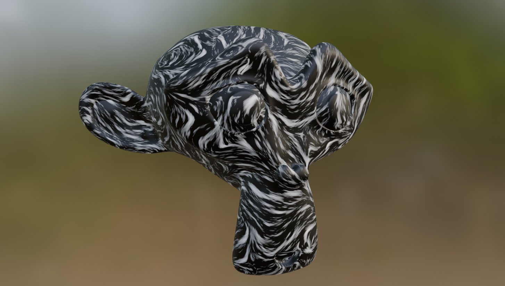

# Steerable Perlin Noise
To appear in SIGGRAPH Talks 2025

## Abstract

Perlin noise is an integral tool for generating procedural textures for computer graphics applications. It's widely used across multiple industries and applications due to its simplicity, speed and controllability. We present 2 simple changes to the Perlin noise algorithm that allows for anisotropy in the output noise. We believe these small adjustments open the door to new texturing workflows as well as simple vector field visualizations in multiple dimensions.

## Paper
If you're interested in reading the full paper and supplementary, they're included in the PDFs folder.

## Implementations
This repo contains implementations for steerable perlin noise in the following programs: Houdini, Unity, Godot, Blender

This project also includes shadertoy demos which can be found here:

**[ [2D Steerable Noise](https://www.shadertoy.com/view/W3dXzj) ]**
**[ [Projected Steerable Noise](https://www.shadertoy.com/view/WXdXzj) ]**
**[ [3D Volumetric Steerable Noise](https://www.shadertoy.com/view/W3tSR2)]**